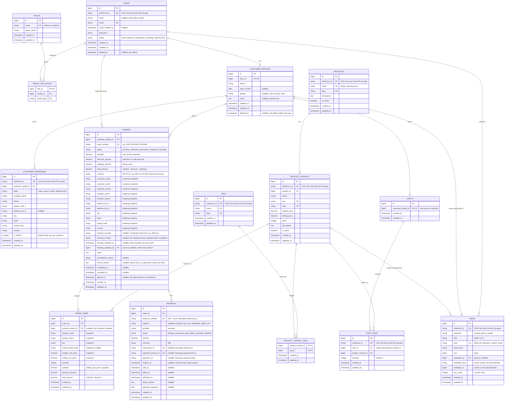

# Database ER Diagram

Source of truth for the Artistic Hub database schema. Migrations in `database/migrations` and models in `app/Models` should match this diagram. If the schema changes, update this file in the same change.

## Notes

- Client-facing ids (decided 2026-10-03): `users`, `customer_addresses`, `products`, `product_variants`, `tags`, `media` and `cart_items` have a `reference_id` (ULID, unique). The API accepts only `reference_id` (in URLs and requests); responses show both `reference_id` and the internal `id` (for reference only). The auto-increment `id` stays the primary key for foreign keys and joins.

- Roles use `spatie/laravel-permission` tables (`roles`, `model_has_roles`). The two roles are `admin` and `customer` (`App\Enums\Role`), guard `web`. The package's migration also creates `permissions`, `model_has_permissions` and `role_has_permissions`; they stay empty because only roles are used.
- Not shown: Laravel's framework tables (`password_reset_tokens`, `sessions`, `cache`, `jobs`), `users.remember_token`, and Laravel Passport's tables (`oauth_clients`, `oauth_access_tokens`, `oauth_refresh_tokens`, `oauth_auth_codes`, `oauth_device_codes`). Only `oauth_clients` (one personal access client) and `oauth_access_tokens` (sign-in tokens, linked to `users.id`) are used.
- `users.name` is null until the customer creates their profile (registration collects only email and password; agreed 2026-10-02). Admins always have a name.
- Status and label columns are strings backed by enums in `app/Enums`: `users.status` (`UserStatus`, default `active`), `customer_profiles.gender` (`Gender`), `customer_addresses.label` (`AddressLabel`, default `home`).
- `users` and `customer_profiles` use soft deletes (`deleted_at`). Soft-deleting a user also soft-deletes their profile, and restoring the user restores it (`User::booted()`). A soft-deleted user is hidden from normal queries, so they cannot sign in; their email stays reserved by the unique index (it cannot be registered again); their role and addresses are kept (addresses are only reached through the profile, so they are hidden with it). Records that must keep pointing at the profile, such as orders, load it with `withTrashed()`. Only a force delete removes the rows, and that cascades to the profile and addresses. There is no user-deletion feature in the API yet.
- `orders` and `order_items` store **snapshots** of customer, address, product, and price data from the time of the order. Never read these values back from the live product or profile tables.
- `order_items.product_variant_id` is nullable, so order history survives when a variant is deleted.
- `orders.tracking_number` is required before an order moves to `completed`. Tracking (decided 2026-10-03) is set only through `PATCH /admin/orders/{order_number}/tracking`. `tracking_provider` (a key from the fixed list in `App\Enums\TrackingProvider`, such as `delhivery`; there is no free-text option) and `tracking_number` (text, up to 100 characters) are saved together, with `tracking_updated_at` and `tracking_updated_by` (the admin; null if that user is later force-deleted) as the audit of the current values. Earlier values are not kept; a full history table is still open. Saving tracking sets `status = completed` (fulfilled: handed to the courier, not delivered), and `completed_at` the first time.
- Each customer has at most one cart (`carts.customer_profile_id` is unique), and a variant appears once per cart (`cart_items` is unique on `cart_id` + `product_variant_id`); adding it again increases `quantity`. Cart items store **no prices**: checkout reads the current price, stock and active state and asks the customer to reconfirm if anything changed. Paying clears only the quantities that were paid for. Deleting a variant deletes its cart items (cascade); order items keep their snapshot with `product_variant_id` set to null.
- Catalog columns as built: `product_variants.original_price` / `selling_price` are `decimal(10,2)` with `selling_price <= original_price` (checked by the app); `stock` is unsigned; `sku` is up to 64 characters; tag `name` is up to 100 characters. Deleting a product deletes its variants and tag links (cascade); its variants' photos are detached (see `media`). Deleting a tag deletes only its links.
- `media` (decided 2026-10-03) holds every uploaded file: variant photos (`collection = variant_photo`) and customer avatars (`collection = avatar`). It is polymorphic: `mediable_type` + `mediable_id` point at the owner (`App\Models\ProductVariant`, `App\Models\CustomerProfile`). An upload creates a row with no owner; saving the owner attaches it. Rows still unattached after 24 hours are pruned with their files (`php artisan model:prune`, scheduled daily). `path` is unique; `disk` records where the file is; `sort_order` 0 is a variant's cover. A polymorphic relation has no database foreign key, so the app does what `nullOnDelete` would: when a variant is deleted (directly, left out of a product save, or with its product) its photos get `mediable_type` / `mediable_id` set to null, and the daily prune then deletes those rows and their files.
- Checkout (built 2026-10-03): an order is created `pending` with its snapshots when the customer presses Pay, and `placed_at` (the order date the customer sees) is set only when the payment is confirmed and the status becomes `confirmed`; there is no separate `confirmed_at` (decided 2026-10-03). `order_number` looks like `ORD-20261003-7K2Q9M`. Prices include GST and no shipping is charged yet, so `shipping_amount` is 0; `discount_amount` is an order-level discount (none yet), not the MRP savings. `order_items.variant_photo_path` is the media path of the variant's cover at checkout. Each payment row is one Razorpay payment link: `payment_number` (`PAY` + ULID) is sent as Razorpay's `reference_id`, `payment_session_id` is the link id (`plink_…`), `payment_url` is the page the customer is sent to and `expires_at` when it stops working; `transaction_id` and `method` are filled from the confirmed payment (`method` is null until then). An order can have several payment rows (a retry after a failed or expired link); the newest one (`Order::latestPayment()`) gives the order's payment status, and `orders` keeps no copy of it.
- How checkout fills `orders`, `order_items` and `payments` (amount formulas, snapshots, order number, `created_at` vs `placed_at`, `latestPayment`): `docs/checkout-and-payments.md`.
- `orders.review_reason` (added 2026-10-03) says why an admin should look at an order, for example it was paid when stock was short (there is no stock reservation). Null when there is nothing to check. Never shown to customers.
- Currency (decided 2026-10-03): the shop has one currency, `config('app.currency')` (`INR`), so product prices have no currency column. Checkout copies it to `orders.currency`, which covers every amount on the order and its items. `payments.currency` is copied from the order, and is what Razorpay charged.
- Money columns are `decimal`. `orders.total_amount = subtotal - discount_amount + shipping_amount`; `order_items.total_amount = subtotal - discount_amount`.

## Diagram

