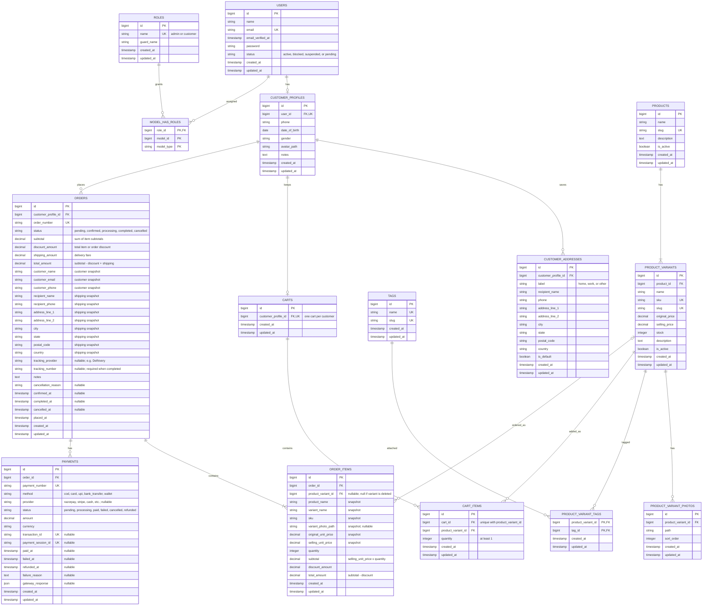

# Database ER Diagram

Source of truth for the Artistic Hub database schema. Migrations in `database/migrations` and models in `app/Models` should match this diagram. If the schema changes, update this file in the same change.

## Notes

- Roles use `spatie/laravel-permission` tables (`roles`, `model_has_roles`). The two roles are `admin` and `customer`.
- `orders` and `order_items` store **snapshots** of customer, address, product, and price data from the time of the order. Never read these values back from the live product or profile tables.
- `order_items.product_variant_id` is nullable, so order history survives when a variant is deleted.
- `orders.tracking_number` is required before an order moves to `completed`.
- Each customer has at most one cart (`carts.customer_profile_id` is unique), and a variant appears once per cart (`cart_items` is unique on `cart_id` + `product_variant_id`); adding it again increases `quantity`. Cart items store **no prices**: checkout reads the current price, stock and active state and asks the customer to reconfirm if anything changed. Paying clears only the quantities that were paid for. Deleting a variant deletes its cart items (cascade); order items keep their snapshot with `product_variant_id` set to null.
- Money columns are `decimal`. `orders.total_amount = subtotal - discount_amount + shipping_amount`; `order_items.total_amount = subtotal - discount_amount`.

## Diagram

